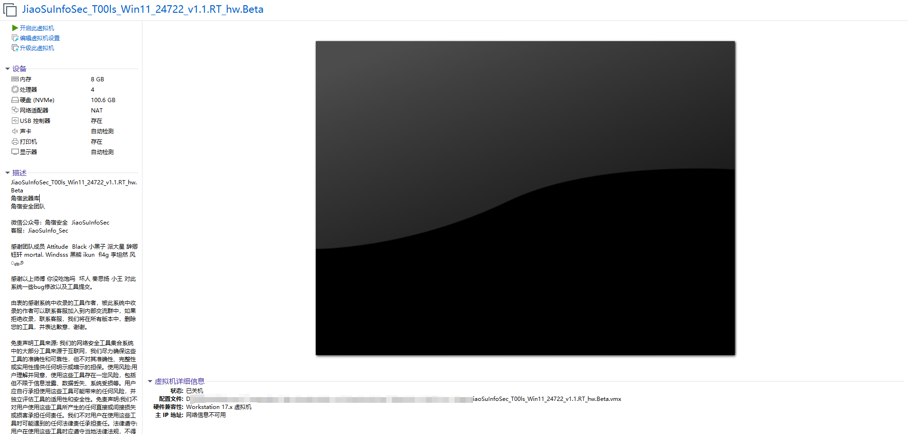
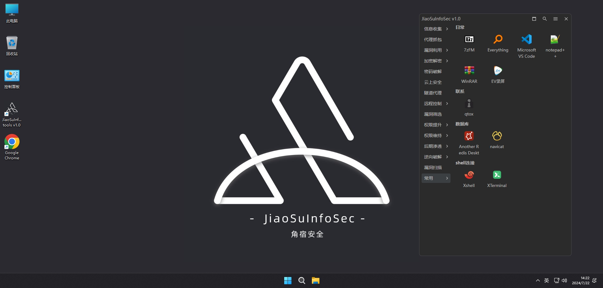

#  🚀	JiaoSuInfoSec_T00ls_Win11


### :small_red_triangle:角宿武器库
<br/>
  <p align="center">


</p>

微信公众号：角宿安全  `JiaoSuInfoSec`

------
📢 环境提示：
```shell
python39 sqlmap.y
python27 sqlmap.y
java -jar xx.jar
```
本系统开发时的初衷：`更快 更好 更简洁 更方便 更贴近`

作者在使用一些渗透系统的时候，发现工具过于重复，累赘，很多东西甚至是不需要的工具，因此和一些小伙伴共同设计了此系统，经过两个月内测，以及优化，经过群内两百多名师傅的测试下，`JiaoSuInfoSec_T00ls_Win11_24722_v1.1.RT_hw.Beta`发布

添加`JiaoSuInfo_Sec`客服微信，进入交流群，提交新工具以及Bug

包含工具请查看下图工具矩阵：[工具矩阵](https://github.com/JiaoSuInfoSec/JiaoSuInfoSec_T00ls_Win11/blob/main/README.md#%E5%B7%A5%E5%85%B7%E7%9F%A9%E9%98%B5)


### :world_map:更新

- JiaoSuInfoSec_T00ls_Win11_24722_v1.1.RT_hw.Beta 
  - 压缩后大小：18.0 GB 
  - 解压后大小：30.6 GB
  - MD5：BE0C77C526E4573B109BF92E434085A9
  - SHA1: EE83493C35C7B648DCE0AB3EF7404B3A42B4E3A9
  ```
  密探信息收集
  git RCE漏洞 CVE-2024-32002
  heapdump_tool
  MemoryAnalyzer
  修改heapdump分类问题
  添加百度网盘
  禁止快捷工具检测更新
  burpsuite_pro_v2024.4.1 修复字体Bug
  geoservers-CVE-2024-36401
  nuclei更新模板库至v9.9.1
  nuclei更新3.3.0
  ```

### :beginner:系统截图






### 工具矩阵
<details>
<summary><b>:closed_lock_with_key:工具矩阵</b></summary>

### 感谢

感谢团队成员 Attitude  Black 小黑子 派大星 辞卿 钰轩 mortal. Windsss 黑熊 ikun  fl4g 李坦然 风ೄ೨

感谢以上师傅 你没吃饱吗  坏人 秦思扬 小王 对此系统一些bug修改以及工具提交。

由衷的感谢系统中收录的工具作者，被此系统中收录的作者可以联系客服加入到内部交流群中，如果拒绝收录，联系客服，我们将在所有版本中，删除您的工具，并表达歉意，谢谢。


</details>
