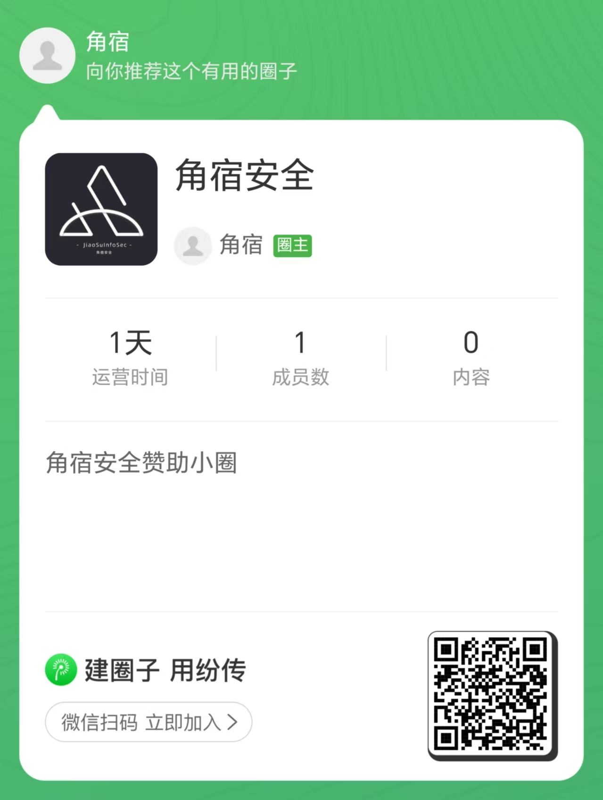

#  🚀	JiaoSuInfoSec_T00ls_Win11


### :small_red_triangle:角宿武器库
<br/>
  <p align="center">


</p>

微信公众号：角宿安全  `JiaoSuInfoSec`

------
📢 环境提示：
```shell
java -jar  xxx.jar
python39 xx.py
python27 xxx.py
pwsh [powershell7] 
KALI：kali/kali  # kali 用户名/密码
```
本系统开发时的初衷：`更快 更好 更简洁 更方便 更贴近`

作者在使用一些渗透系统的时候，发现工具过于重复，累赘，很多东西甚至是不需要的工具，因此和一些小伙伴共同设计了此系统，经过两个月内测，以及优化，经过群内三百多名师傅的测试下，`JiaoSuInfoSec_T00l`武器库发布

添加`JiaoSuInfo_Sec`客服微信，进入交流群，提交新工具以及Bug

包含工具请查看下图工具矩阵：[v1.1工具矩阵](https://github.com/JiaoSuInfoSec/JiaoSuInfoSec_T00ls_Win11/blob/main/README.md#%E5%B7%A5%E5%85%B7%E7%9F%A9%E9%98%B5)

目前最新版本：

JiaoSuInfoSec_T00ls_Win11_250119_OSv3.0


###  建议虚拟机版本： VMware Workstation Pro 17.5


### :world_map:更新
------
- JiaoSuInfoSec_T00ls_Win11_250119_OSv3.0_KALI_Beta.zip 【KALI版本】
  - 压缩后大小：23.1 GB 
  - MD5: 60CC48CA8090531B9C970A3841E79219
  - SHA1: C4FB496FBB61C3E8DDBA65A55D72BEAA1842C44A
- JiaoSuInfoSec_T00ls_Win11_250119_OSv3.0_RT_Beta.zip 
  - 压缩后大小：23.3 GB 
  - MD5: 7A8735DC19739C93E7BB3792689F85B5
  - SHA1: A3D87091BAD5EF829D474E05706EC3749CA30FC3
- JiaoSuInfoSec_T00ls_250119_OSv3.0_PM.zip 为物理机版本【此版本内测中】
  - 大小：37.1 GB
  - MD5: 610F66818F83D10D01955F76DD42644D
  - SHA1: 6F35A35BA3FFBA9DE43005D37347EBBAD21DB001

```
## 更新内容：
1. searchall
2. zombie
3. spray
4. EquationToolsGUI
5. Struts2VulsScanTools
6. eBSploit
7. PowerShell7
8. Process Lasso
9. Slack
10. PostHikvision
11. Godzilla-Suo5MemShell
12. OBS Studio
13. npscrack
14. nps-auth-bypass
15. Kubectl
16. openvpn
17. Hikvision-
18. NacosExploit
19. JenkinsExploit-GUI
20. API-Explorer
21. xxl-job-FLM
22. web-chains
23. DockerApiRCE
24. TomcatScanPro
25. SBSCAN
26. jdwp-codeifier
27. DecryptExample
28. MDUT-Extend-1.2.0
29. DockerAPITool
30. fscan  v2.0.0-build1
31. gogo v2.13.6
32. Clink
33. jMG v1.0.9
34. Vivaldi

## 修复
1. 修改项目名字Neo-reGeorg
2. 升级ssh软件道最新版本
3. NEO4J_HOME环境变量将信息收集改为Discovery
```
### :beginner:系统截图


### v1.1工具矩阵
<details>
<summary><b>:closed_lock_with_key:工具矩阵</b></summary>
  
  
  
</details>
  
### 感谢

感谢团队成员 Attitude  Black 小黑子 派大星 辞卿 钰轩 mortal. Windsss 黑熊 ikun  fl4g 李坦然 风ೄ೨

感谢以上师傅 你没吃饱吗  坏人 秦思扬 小王 Riddim 强少张  kkbo zero对此系统一些bug修改以及工具提交。

由衷的感谢系统中收录的工具作者，被此系统中收录的作者可以联系客服加入到内部交流群中，如果拒绝收录，联系客服，我们将在所有版本中，删除您的工具，并表达歉意，谢谢。

### 客服微信


### 赞助
【如果觉得系统不错，请赞助一下吧，赞助之后，提供加入截图ID号，联系客服进内部交流群】

内部群含有工具在线网盘，可以自己装备自己的系统

带有虚拟机以及物理机使用方法

内测系统物理机新工具优先内部群使用


